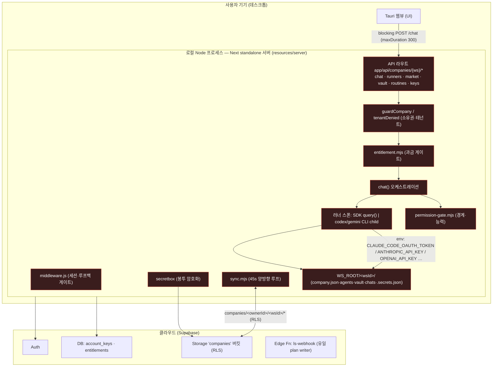
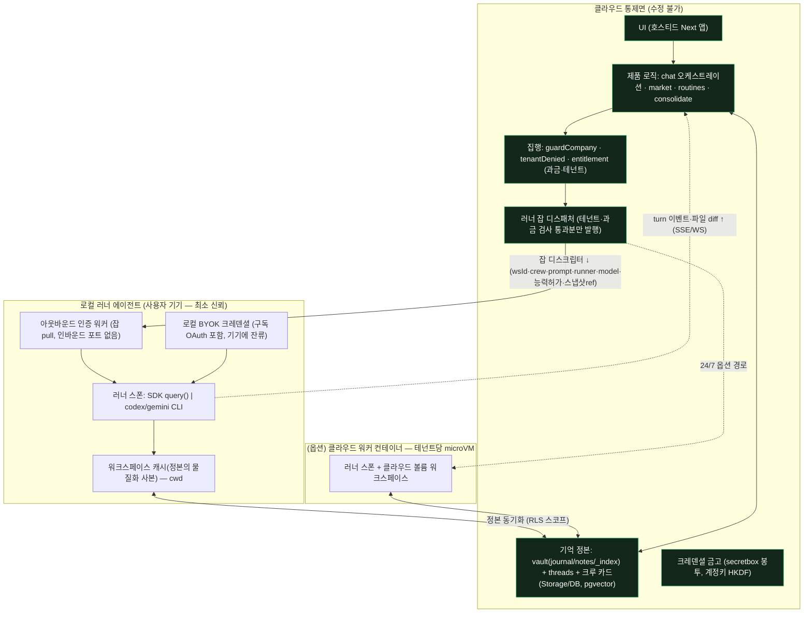

# Argo 클라우드 하이브리드 전환 설계서

> **[2026-07-23 갱신 — 현 스코프에선 참고용]** 24h 상주를 후순위로 내리며 스코프가 바뀌었다.
> 현 스코프의 **정본 설계는 [`local-first-design.md`](local-first-design.md)**. 이 문서는 *24h 클라우드 워커·클라우드 실행을 원할 때*의
> 설계로 여전히 유효하며(분석 자체는 정확), 24h 상주를 다시 최우선으로 올릴 때 복귀한다.

> 작성 배경: 2026-07-22 유건 지시. 데스크톱이 **Tauri + 로컬 Node(Next standalone 소스 전체)** 구조라
> 크루·사용자가 앱 본체(제품 로직·게이트 코드)를 수정할 수 있다. `permission-gate.mjs`의 게이트는
> **완화(mitigation)일 뿐** 근본 경계(boundary)가 아니다 — 게이트 코드 자체가 사용자가 쓰기 가능한
> 디스크에 있고, 사용자 권한으로 도는 프로세스가 집행하기 때문이다.
> **근본 해소 = 제품 로직·기억 정본을 클라우드로 이전**하고, 로컬에는 러너 스폰·로컬 파일 능력만 하는
> 소형 "러너 에이전트"만 남긴다.
>
> - 이 문서는 **설계만** 다룬다 — 코드 변경 없음.
> - 시크릿 값 평문 금지: 아래는 전부 **환경변수 이름·저장 위치**만 참조한다.
> - 근거: 본문 주장은 대부분 `file:line` 앵커로 재현 가능(부록 A). 미검증·배경근거는 그렇게 표기.

## North Star (전환의 목적지)

> 제품 로직·과금·테넌트 경계·기억 정본이 **사용자가 수정할 수 없는 클라우드 통제면**에 있고,
> 로컬에는 "러너를 띄우고 로컬 파일을 만지는" 최소 실행기만 남아, 로컬을 아무리 뜯어고쳐도
> **자기 기기·자기 워크스페이스 밖으로는 영향이 없다.**

성공 지표(Metric Lock):
1. 로컬 러너 에이전트를 임의 수정해도 (a) 과금 우회 불가, (b) 타 테넌트 데이터 도달 불가, (c) entitlement 위조 불가 — 클라우드에서 실측.
2. 현 릴리즈 라인(데스크톱 업데이터 · CLI 타르볼 · Fly 워커)이 전환 내내 깨지지 않는다.
3. Free 로컬 전용 사용자는 전환 후에도 "한 바이트도 안 나가는" 로컬 경험 그대로.

---

## 0. 문제 정의 — 왜 게이트로는 부족한가

현재 게이트(`src/permission-gate.mjs`)는 두 가지를 집행한다(실측):
- **워크스페이스 경계** — `Read/Glob/Grep/Write/Edit`의 경로 인자가 `WS_ROOT/<wsId>` 밖이면 차단(심링크 탈출 방어 포함, `permission-gate.mjs:31-43,70-92`).
- **능력 게이트** — `fs/browser/shell`이 꺼져 있으면 부작용 도구를 멈추고 "켤까요?" 카드를 올린다(`permission-gate.mjs:60-101`, `capabilities.mjs:8-12`).

> 배경근거(미실측 — 이 워크트리는 v0.1.22): 유건 배경 설명상 v0.1.23이 여기에 **금지 구역(보호 경로)**을
> 추가했다. 이 워크트리에는 아직 없다(grep 확인: `permission-gate.mjs`에 forbidden/금지 경로 개념 부재).

**게이트가 근본 경계가 아닌 이유 (핵심 논증):**

1. 데스크톱은 `Next standalone 서버 트리 전체`(= `src/*.mjs` 컴파일본)를 `resources/server`로 번들해 사용자 디스크에 깐다(`scripts/stage-sidecar.mjs:30-34`, `tauri.conf.json:53-55`).
2. Tauri 셸이 그 트리에서 번들 `node`로 `server.js`를 스폰한다(`src-tauri/src/lib.rs:110-121`) — **사용자 권한으로** 도는 로컬 프로세스.
3. 게이트·능력·entitlement·소유권 검사·봉투 암호화가 **전부 그 프로세스 안에서** 집행된다.
4. 그 프로세스의 소스는 **쓰기 가능한 디스크**에 있다 → 기기 주인(또는 `shell`을 켠 크루)이 `server.js`/`permission-gate.mjs`를 편집하면 게이트는 무력화된다.

즉 게이트는 **프롬프트 인젝션·우발적 과잉·초보 오조작의 문턱을 높이는 완화**로는 유효하지만,
**기기를 통제하는 주체(사용자 또는 shell 능력 크루)에 대한 경계**는 될 수 없다.
과금·테넌트 격리·기억 무결처럼 **사용자와 이해가 상충하는 규칙**은 사용자가 못 고치는 곳(클라우드)에서 집행돼야 한다.

---

## 1. 현행 아키텍처와 노출 표면

### 1.1 하나의 코드베이스, 네 가지 실행 모드

같은 Next.js 앱이 env 유무만으로 4개 모드로 실행된다(`app/auth.mjs:11,21`, `middleware.js:16-45`).

| 모드 | 트리거(env) | 인증 | 호스트 제약 | 정본 데이터 |
|---|---|---|---|---|
| 로컬 무인증(1인) | Supabase env 없음 | 없음 (`user='local'`) | 루프백 강제 | 로컬 FS |
| 기기 연동(desktop) | Supabase env + `ARGO_TENANT_OWNER` 없음 | 기기 세션 파일 | 루프백 | 로컬 FS + Storage 복제 |
| 쿠키 공개(셀프호스트) | Supabase env, 비루프백 | Supabase 쿠키 | 임의 | 로컬 FS + Storage 복제 |
| 클라우드 워커 | `ARGO_TENANT_OWNER` 설정 | Supabase 쿠키 | Fly, **1인스턴스=1계정** | Fly 볼륨 `/data` |

- **데스크톱 실제 동작**: Tauri 셸이 `node server.js`를 `127.0.0.1:3001`(폴백 3011/3021)로 스폰하되 **Supabase env를 주입하지 않는다** → 데스크톱은 사실상 "로컬 무인증 모드"로 돈다(`AUTH_ON=false`). 웹뷰가 그 로컬 서버를 가리킨다.
- **클라우드 워커**는 이미 존재한다: `ARGO_TENANT_OWNER`(Supabase user id) 바인딩으로 그 계정 외 요청을 전부 403 (`app/auth.mjs:22-28`), `/data` 볼륨이 테넌트 워크스페이스 전부(`fly.toml:11-13`), 게이트웨이 폴러·루틴 스케줄러 상주(`instrumentation-node.mjs:18-20`).

### 1.2 현행 구조 다이어그램

빨간 블록(= **집행·정본이 로컬 프로세스 안**)이 곧 노출 표면이다.

### 1.3 노출 표면 목록 (근거 기반)

| # | 노출 | 근거 | 위험 |
|---|---|---|---|
| E1 | 제품 소스 전체가 사용자 디스크에 있음(읽기·쓰기 가능) | `stage-sidecar.mjs:30-34`, `tauri.conf.json:53-55` | 게이트/과금/소유권 코드 자체를 편집해 무력화 |
| E2 | 게이트·능력·entitlement·guardCompany가 로컬 프로세스에서 집행 | `permission-gate.mjs`, `entitlement.mjs:20-24`, `app/auth.mjs:51-74` | 사용자 권한 프로세스라 우회 가능 |
| E3 | 러너가 워크스페이스 root를 cwd로 로컬 FS 전체 접근 | `chat.mjs:369`(cwd `p.root`), `runners.mjs:431-456` | `caps.fs` 시 codex는 `writable_roots=["/"]`(프로세스급, `runners.mjs:412-415`) |
| E4 | BYOK 크레덴셜이 로컬에 존재·복호 가능 | `.secrets.json`(`runners.mjs:485`), `account_keys` HKDF(`secretbox.mjs:18-26`) | 수정된 로컬 프로세스가 계정 키를 받아 복호 |
| E5 | 셀프호스트/워커 모드는 기기에 `SUPABASE_SERVICE_ROLE_KEY` 보유 | `synccreds.mjs:24-25` | **RLS 우회 크라운주얼** — 전 테넌트 스토리지 접근 |
| E6 | 기억·대화·크루·스킬이 Storage에 **평문** 업로드 | `secretbox.mjs:43`(`isSecretRel`=크레덴셜 2~3종만), `security-encryption-roadmap.md:12-16` | 운영자·Supabase가 원리상 맥락 데이터 복호 가능 |
| E7 | 정본이 로컬 FS, 클라우드는 복제 | `sync.mjs:1-3`(폴더가 진실의 원천) | 클라우드가 권위 없음 → 로컬 조작이 곧 정본 조작 |

> 핵심: E1·E2가 "게이트=완화일 뿐"의 실체다. E5는 멀티테넌트로 갈 때의 최우선 격리 리스크,
> E6·E7은 "기억을 클라우드 정본으로" 옮기기 전에 반드시 닫아야 할 선행 조건(→ §4 Phase 1, §5).

### 1.4 러너 실행의 로컬 결합 (무엇이 진짜 로컬인가)

전환 설계의 근거가 되는, **본질적으로 로컬**인 부분과 **위치 무관 오케스트레이션**의 구분(`runners.mjs`, `chat.mjs`):

- **본질적 로컬**: codex/gemini CLI 자식 프로세스 스폰(`runners.mjs:431-456`), `WS_ROOT` 파일 트리(cwd), 호스트 로그인 상속(`~/.codex`·`~/.gemini`·`~/.claude*` 탐지, `runners.mjs:216-248`), `~/.argo/*` 격리 HOME, `claude setup-token`의 PTY(`script(1)`)·localhost 콜백 흐름(`runners.mjs:1187-1277`).
- **위치 무관 오케스트레이션**: SDK `query()`는 원격 HTTPS 엔드포인트와 대화(`chat.mjs:744-773`), 러너 선택·폴백·크레덴셜 검증·프롬프트 조립·스레드/사용량 기록은 전부 HTTP+JSON 스토어 위의 순수 로직.

이 분리가 **§2의 경계선**을 그대로 그어준다: 위치 무관 오케스트레이션 = 클라우드로, 본질적 로컬 = 러너 에이전트로.

---

## 2. 목표 아키텍처 — 클라우드 통제면 / 로컬 러너 에이전트

### 2.1 경계 원칙

- **클라우드 = 두뇌이자 경계.** UI·제품 로직·기억 정본·과금·테넌트 게이트를 클라우드가 소유한다. 사용자가 수정 불가.
- **로컬 러너 에이전트 = 최소 실행기.** 딱 두 가지만 한다: (a) 러너 스폰(SDK/CLI), (b) 자기 워크스페이스에 대한 로컬 파일 능력. 과금·테넌트·타 사용자 데이터·정본 기억을 **모른다**.
- **재사용**: Supabase Auth(기기 세션/쿠키), Storage `companies` 버킷 + RLS(`companies/<ownerId>/<wsId>/`), `ARGO_TENANT_OWNER` 바인딩, `account_keys`·`entitlements` 테이블, secretbox 봉투. — 새로 발명하지 않고 방향만 뒤집는다.

### 2.2 목표 구조 다이어그램

### 2.3 클라우드↔로컬 프로토콜

현행 코드에 이미 있는 두 패턴을 재사용해 **인바운드 포트 없이** 성립한다:

1. **아웃바운드 잡 pull (러너 에이전트 → 클라우드).** 러너 에이전트가 같은 Supabase 계정(또는 스코프된 에이전트 토큰)으로 로그인해 클라우드에서 "턴 잡"을 당겨온다. NAT/방화벽 뒤에서도 동작. — 이는 현행 게이트웨이의 **디스크 잡 큐 + 기기 태깅**(`gateway.mjs:65-112`, `update_id` 디둡·기기ID 태그)과 **클라우드 리스 리더**(`sync.mjs:107-140`, `isCloudLeader`)를 뒤집은 형태다. 지금은 로컬이 리더를 쥐지만, 목표는 **클라우드가 항상 코디네이터**, 로컬은 턴을 리스해 실행하는 워커.
2. **잡 디스크립터 (↓)**: `{ wsId, crewSlug, instruction, runnerType, model, capabilityGrants, workspaceSnapshotRef, resumeId }`. 클라우드는 **디스패치 전에** `tenantDenied`+`guardCompany`+`syncEntitled`를 통과한 잡만 발행한다(집행이 사용자 밖으로 이동).
3. **턴 이벤트 스트림 (↑)**: 러너의 tool 이벤트·진행 상태·최종 reply·파일 diff. — 현행은 SSE가 없고 blocking POST + 폴링(`turn-status.mjs`, `chat.mjs:743,786`)이지만, 클라우드/로컬이 분리되면 **SSE/WebSocket로 진짜 스트리밍** 전환이 자연스럽다(연결이 프로세스 경계를 넘으므로).
4. **정본 동기화**: 러너가 만진 파일은 RLS 스코프(`companies/<ownerId>/<wsId>/`)로 클라우드 정본에 반영. 현행 sync 엔진을 **방향만 뒤집어**(원격 매니페스트 권위, 로컬=물질화 캐시) 재사용.

### 2.4 이동 대상 (무엇이 클라우드 정본이 되나)

현재 "로컬 전용" 상태 중 클라우드 정본으로 옮겨야 하는 것(`sync.mjs`, `memory.mjs`, `chat.mjs` 근거):
- **vault 기억 트리** 전체 — journal/notes/_index/files/projects. 지금은 에이전트가 cwd에서 Grep/Read로 직접 읽는 파일(`chat.mjs:70-72,369`); TF-IDF 자동링크는 로컬 스파이크로 pgvector 예정(`memory.mjs:3`).
- **스레드/대화 상태** — `chats/*.json`(현재 in-process 락만; 크로스프로세스 직렬화는 Supabase 예정, `mutex.mjs:2-3`).
- **회사 설정·크루 정의** — `company.json`·`agents/*`·`skills/`·`routines.json`·`capabilities.json`·`approvals.json`.
- **동시성 모델** — 파일별 LWW/3-way 병합(`sync.mjs:284-288`)을 서버측 트랜잭션 쓰기로 대체.
- **스토리지 권위 자체** — `walk(root)`를 정본으로 보는 현행(`sync.mjs:207,292-293`)을 반전: 원격이 권위, 로컬은 캐시.

> 코드가 이미 이 이행을 예고한다: 서비스키 sync는 자가호스팅 전제이고 **패키징 앱은 user JWT+RLS로 전환 예정**(`sync.mjs:16`), 기기 세션(JWT) 경로가 그 훅(`devicesession.mjs`, `sync.mjs:59-77`).

---

## 3. 러너 실행 위치 선택지 + 비용 모델

**핵심 갈림**: 실제 코딩 에이전트(러너 프로세스)가 **어디서** 도는가. 나머지 설계는 이 선택에 종속된다.

### 3.1 Option A — 로컬 BYOK 러너 에이전트 (사용자 기기에서 실행)

얇은 로컬 에이전트가 러너를 로컬에서 스폰(cwd=로컬 워크스페이스 캐시), 사용자 자기 크레덴셜(API 키 또는 `claude setup-token` 구독 OAuth) 사용.

- 장점
  - **Argo 추론 비용 = $0** (순수 BYOK — 사용자가 Anthropic/OpenAI에 직접 지불, 또는 자기 Claude 구독 사용. BYOK가 제품 전제, PRODUCT-SPEC).
  - **구독 OAuth가 약관상 안전** — 토큰이 사용자 자기 기기에서 자기 CLI로 쓰인다(Claude Code 본래 방식). 제3자 서버가 빌려 쓰는 게 아님(PRODUCT-SPEC이 클라우드 구독 OAuth를 미검증 약관 리스크로 표기).
  - 로컬 파일·CLI·`~/.argo` 격리 HOME·호스트 로그인 상속이 전부 그대로 동작.
  - **Argo 컴퓨트 비용 = $0** (사용자 CPU).
- 단점
  - **24/7 아님** — 기기 수면=러너 없음. (현행 갭: `deploy-fly.md:58` "로컬 필요 지시는 워커가 대신 못 한다 — 이연 큐는 후속.")
  - 데스크톱/에이전트 설치·상주 필요.
  - 러너가 여전히 사용자 권한으로 자기 기기에서 실행 — 단 **자기 데이터**라 수용 가능한 신뢰 경계(과금·멀티테넌트 경계는 클라우드가 집행하므로 무관).

### 3.2 Option B — 클라우드 워커 컨테이너 (테넌트당 클라우드에서 실행)

계정당 microVM/컨테이너(기존 Fly 워커·`ARGO_TENANT_OWNER`·`/data` 볼륨)가 러너 스폰, 워크스페이스는 클라우드 볼륨(목표에선 이미 정본).

- 장점
  - **24/7** — 루틴·텔레그램/슬랙 게이트웨이·리서치가 기기가 꺼져도 동작(워커의 존재 이유, `deploy-fly.md:3`).
  - 로컬 설치 불필요, 파일이 이미 클라우드 정본.
  - **1인스턴스=1계정** microVM 경계가 강한 테넌트 격리.
- 단점
  - **컴퓨트 비용** — 활성 테넌트당 상주 머신(`fly.toml`의 `auto_stop_machines=false`, "월 수 달러"). 유료 사용자 수에 선형 비례.
  - **구독 OAuth 약관 리스크**(클라우드, 미검증) → 클라우드 러너는 현실적으로 API 키 BYOK 필요. 여전히 사용자 지불이나 "내 Claude 구독으로" 매력은 상실.
  - 사용자 대신 셸 있는 코딩 에이전트를 클라우드에서 돌림 = **샌드박싱 필수**(계정당 microVM이 곧 샌드박스; 대안 gVisor·Firecracker·Vercel Sandbox).
  - 상시 대신 온디맨드로 하면 콜드스타트/스케줄링(비용↔지연 트레이드오프).

### 3.3 비용 모델 (활성 유료 테넌트당, 자릿수 근사 — 코드·문서 기반, 시세 견적 아님)

| 축 | A: 로컬 BYOK 에이전트 | B: 클라우드 워커(상주) | B′: 클라우드 워커(온디맨드) |
|---|---|---|---|
| 추론(Argo 부담) | $0 (BYOK, 사용자 지불) | API키면 $0; 구독OAuth는 약관 리스크 | 동일 |
| 컴퓨트(Argo 부담) | $0 (사용자 CPU) | 테넌트당 고정 ~수 $/월(auto_stop off) | 사용량 과금, 유휴≈$0 |
| 24/7 | ✗ | ✓ | ✓ (콜드스타트 감수) |
| 구독 OAuth | ✓ 약관 안전 | ✗ 리스크 | ✗ 리스크 |
| 격리 | 사용자 자기 기기 | microVM/계정 | microVM/계정 |
| 프라이버시(E2E) | ✓ 정본만 복호(§5) | ✗ 클라우드가 vault 복호 필요 | ✗ 동일 |

### 3.4 권고 — 하이브리드 (PRODUCT-SPEC 가격 모델과 일치)

- **기본 = 로컬 BYOK 러너 에이전트** (무료·약관 안전·한계비용 $0). Free/Pro 공통 기본 실행 경로.
- **옵션 = 클라우드 워커를 Pro의 24/7 업그레이드로 편입** — PRODUCT-SPEC의 "24h 상주는 성숙 게이트 통과 후 Pro에 가격 인상 없이 편입"과 정확히 일치.
- 클라우드 워커는 **온디맨드(B′)** 우선(잡 있을 때만 머신 기동; Fly machine start-on-job 또는 Vercel Sandbox)으로 유휴 컴퓨트를 0에 수렴시키고, **상주(B)**는 "부재 중 메신저 상시 응대"가 꼭 필요한 테넌트에만.
- 근거: 추론이 BYOK라 Argo 원가는 컴퓨트에만 걸린다. 로컬 기본이면 컴퓨트도 $0 → 제품 검증 단계에서 비용 리스크 0을 유지(BYOK 결정의 원취지).

---

## 4. 마이그레이션 단계 (현 릴리즈 라인 유지, 점진 전환)

**전제**: 클라우드 조각들이 **이미 존재**한다(`ARGO_TENANT_OWNER`·`guardCompany`·RLS·sync 엔진·Fly 워커). 따라서 전환은 신규 발명이 아니라 **권위 방향의 반전**이며, env 플래그 뒤에서 모드를 추가하는 방식이라 빅뱅이 없다.

각 단계는 **기존 4개 모드를 깨지 않고**(회귀 0), 데스크톱 업데이터·CLI 타르볼·Fly 배포 경로를 그대로 유지하며 진행한다.

### Phase 0 — 현재
데스크톱=풀 로컬 서버(정본 로컬 FS), 옵션 Fly 워커 미러. 게이트=permission-gate(완화). 노출 표면 E1~E7 상존.

### Phase 1 — 클라우드 기억 정본화 (sync 반전) + 맥락 암호화
- **선행 필수: M-ENC-1** — 봉투 암호화를 크레덴셜뿐 아니라 **vault 전체**로 확대(`isSecretRel` 게이트를 워크스페이스 전반으로 일반화, `security-encryption-roadmap.md:20-25`). 통과 기준: 스토리지에 평문 맥락 파일 0건 실측. (E6 해소)
- sync 엔진을 반전: 원격 매니페스트가 권위, 로컬은 물질화 캐시. vault·threads·회사 설정이 클라우드 정본. (E7 해소 시작)
- **집행은 아직 로컬**이지만 데이터가 클라우드 앵커로 이동. **릴리즈 영향 없음** — Free 로컬 전용 사용자는 그대로(데이터가 안 나감).

### Phase 2 — 러너 에이전트 프로토콜 정의·출시
- 클라우드↔러너 계약(§2.3) 추출: 잡 디스크립터 ↓, 이벤트·diff ↑, 아웃바운드 인증.
- 클라우드가 턴 잡 발행. **같은 로컬 서버가 러너 에이전트 역할 겸함(듀얼 모드)** — 로컬 UI도 계속 서빙하되 클라우드 발행 잡도 수락.
- **entitlement·테넌트 게이트 검사를 클라우드 디스패치 지점으로 이동** — 집행이 사용자 밖으로. (E2 해소 시작)
- 릴리즈: 호스티드 UI를 argo 클라우드에 라이브. 데스크톱은 웹뷰를 호스티드 UI로 향하게 하되 로컬 러너 에이전트를 구동.

### Phase 3 — 로컬 러너 에이전트 박형화
- 데스크톱/CLI의 "러너-에이전트-온리" 모드 출시: 제품 UI·과금·테넌트 게이트를 **더 이상 서빙/집행하지 않음** — 러너 스폰 + 로컬 FS만. UI는 클라우드 전용. (E1 해소 — 로컬에 집행 코드가 없어짐)
- **풀 로컬 서버는 셀프호스트 SKU로 분리 존속**(자기 Supabase, 자기 책임 — 기존 `docs/selfhost.md` 경로).
- 릴리즈: 신규 데스크톱 빌드는 러너-에이전트 모드 기본. 기존 풀-로컬 설치는 업데이터로 옵트오버 전까지 계속 동작(회귀 0).

### Phase 4 — 클라우드 러너 옵션 + 호스티드용 풀-로컬 폐기
- 온디맨드 클라우드 워커(Option B′)를 Pro 24/7 업그레이드로 추가.
- 호스티드 제품의 정본 두뇌는 완전 클라우드; 로컬 에이전트는 옵션(BYOK/구독 턴·로컬 파일 작업용).
- 셀프호스트는 풀스택 유지. 릴리즈 라인 불변: 업데이터는 얇은 에이전트를 계속 배달, Fly 배포 경로 그대로.
- **(신뢰 강화, 결제 후) M-ENC-2 진짜 E2E/제로지식**(기존 M-3) — §5의 클라우드-러너 vs 제로지식 긴장 참고.

### 전환 불변식 (매 단계 역대조)
- 기존 4개 모드(로컬 무인증·기기 연동·쿠키 공개·워커) 모두 계속 동작.
- Free 로컬 전용 = "한 바이트도 안 나감" 유지.
- 데스크톱 업데이터 · CLI 타르볼 · Fly 워커 배포 = 무중단.

---

## 5. 리스크·보안

### 5.1 자격(크레덴셜) 보관 위치 — 중심 결정
- **로컬 BYOK 에이전트**: 키가 사용자 기기에 잔류(최상 프라이버시, 구독 OAuth 약관 안전). **권고**: 러너를 스폰하는 기기 밖으로 키가 나가지 않게.
- **클라우드 워커**: 키가 클라우드에 도달 → **봉투 암호화(secretbox v2, `account_keys` HKDF)로만 저장**, 스폰 시점에 격리된 테넌트 컨테이너 env로만 주입, **평문 영속 금지**. 현행 `scrubServerSecrets`가 이미 크로스-프로바이더/서비스롤 var를 자식 env에서 제거(`runners.mjs:58-85`) — 이 규율을 클라우드 러너에도 확장.

### 5.2 서비스롤 키 = 크라운주얼 (E5)
- 현행 sync는 `SUPABASE_SERVICE_ROLE_KEY`로 RLS를 **우회**(자가호스트/워커, `synccreds.mjs:24-25`). 멀티테넌트 클라우드에서 이 키는 **통제면 서버에만** 두고 **테넌트 러너(로컬이든 클라우드든)에는 절대 존재 금지**.
- 목표: 코드가 이미 예고한 **user JWT + RLS 러너/sync 경로**로 완주(`sync.mjs:16`) → 러너는 자기 테넌트로 스코프된 토큰만 보유.
- 단일 프로세스에서 다중 오너 sync는 아직 미해결(`sync.mjs:681` "다중 오너는 P2"). 서비스롤이 도달 가능한 동안은 **1인스턴스=1테넌트(microVM)** 격리를 깨지 말 것.

### 5.3 테넌트 격리 — 재사용 모델
- `companies/<ownerId>/<wsId>/` RLS(첫 세그먼트=경계, `20260714090000_companies_storage_rls.sql:5-23`) + `guardCompany` 소유권(`app/auth.mjs:70-72`) + `ARGO_TENANT_OWNER` 1계정 바인딩.
- 클라우드 러너는 계정당 microVM(기존 Fly)을 실행 샌드박스로 유지. 로컬 러너는 격리가 본질적(자기 기기·자기 데이터).

### 5.4 이 전환의 진짜 보안 이득
집행(과금·테넌트·기억 정본)이 **사용자 쓰기 가능 로컬 프로세스 밖 → 클라우드 통제면**으로 이동한다. 그 결과 사용자(또는 shell 크루)가 로컬 러너 에이전트를 뜯어고쳐도 **자기 기기·자기 워크스페이스 안에서만** 유효 — 과금 우회·정본 기억 도달·타 테넌트 접근·entitlement 위조가 **구조적으로 불가**해진다. 온-디스크 게이트가 절대 보장 못 하던 것. 로컬 게이트(permission-gate)는 러너의 로컬 blast radius를 줄이는 **심층 방어**로 남되, 더는 과금/테넌트 경계가 아니다.

### 5.5 클라우드 러너 vs 제로지식(E2E)의 긴장
클라우드 러너는 에이전트에 먹이려면 vault를 **복호**해야 한다 → 진짜 제로지식(M-ENC-2)과 양립 불가. 프라이버시 최우선 테넌트에게 **로컬 BYOK 러너가 정답**인 또 다른 이유. 설계는 두 경로를 공존시키되(로컬=제로지식 지향, 클라우드=운영 방어선 M-ENC-1), UX에서 트레이드오프를 명시.

### 5.6 러너 blast radius 비대칭
codex `caps.fs`는 `writable_roots=["/"]`(프로세스급, tool급보다 거침, `runners.mjs:412-415`). 클라우드 컨테이너에선 microVM이 봉인하지만, 로컬 에이전트에선 사용자 자기 기기다. 이 비대칭을 능력 UI·문서에 명시.

### 5.7 부수 발견 (전환과 별개로 확인 권장)
- `src/runners.mjs:773`에 gemini-cli 설치형 앱 OAuth용 **하드코딩된 Google client secret 문자열**이 소스에 커밋돼 있다(값은 여기 미기재). 코드 주석은 "Google 문서상 공개 installed-app 상수"라 주장하나, 커밋된 크레덴셜 문자열은 스캐너·로테이션 부채가 된다 — **의도적 공개 상수임을 명시적으로 확인·문서화**하거나 서버측으로 옮길지 검토 권장. (설계 범위 밖의 위생 항목)

---

## 부록 A — 코드 근거 인덱스 (재현용)

> 워크트리 기준 경로/라인. 이 워크트리(`argo-runner-fixes`)의 `src/runners.mjs`는 1282줄로 main(491줄)보다 앞섬(Kimi 러너·CLI 자동 프로비전·`scrubServerSecrets` 추가) — 라인은 워크트리 정본.

- 데스크톱 번들·스폰: `scripts/stage-sidecar.mjs:30-34,52-67`, `src-tauri/tauri.conf.json:50-55`, `src-tauri/src/lib.rs:75,110-121,160-168`
- 게이트/능력: `src/permission-gate.mjs:31-43,60-101`, `src/capabilities.mjs:8-14`
- 인증·테넌트·소유권: `app/auth.mjs:11,21-28,31-46,51-74`, `middleware.js:16-45`
- 과금: `src/entitlement.mjs:7-24`, `supabase/functions/ls-webhook/index.ts:61-67`, `supabase/migrations/20260714150000_entitlements.sql`
- 러너 스폰·BYOK: `src/runners.mjs:123-181,216-248,412-456,494-508,624-663,717-726`, `src/chat.mjs:369,744-773`, `app/api/companies/[ws]/chat/route.js:9,34,39`
- 크레덴셜·암호화: `src/secretbox.mjs:18-43`, `src/accountkey.mjs:18-45`, `src/synccreds.mjs:23-59`, `src/devicesession.mjs:43-91`
- 동기화·기억: `src/sync.mjs:1-3,16,30-83,107-140,201-295`, `src/memory.mjs:58-162`, `src/consolidate.mjs:68-165`, `src/workspace.mjs:7-41`
- 스토리지 RLS: `supabase/migrations/20260714090000_companies_storage_rls.sql:1-23`, `account_keys`: `20260714120000_account_keys.sql`
- 클라우드 워커: `fly.toml`, `docs/deploy-fly.md`, `docs/selfhost.md`, `docs/security-encryption-roadmap.md`

## 부록 B — 열린 질문 (후속 결정 필요)
1. 러너 에이전트 인증: Supabase 기기 세션 재사용 vs 전용 스코프 에이전트 토큰? (전자가 재사용↑, 후자가 최소권한↑)
2. 온디맨드 클라우드 워커 런타임: Fly machine start-on-job vs Vercel Sandbox vs 자체 Firecracker? (콜드스타트·격리·비용 실측 필요)
3. 정본 기억 저장소: Storage 파일 유지 + pgvector 인덱스 vs DB 이관? (autolink의 pgvector 전환과 묶임, `memory.mjs:3`)
4. 잡 큐 전송: 기존 디스크 큐/리스 패턴 확장 vs Supabase Realtime/Queues 도입?
5. 오프라인 편집 병합: 로컬 캐시가 오프라인 편집 후 재동기화할 때의 충돌 정책(현행 파일별 3-way를 서버 트랜잭션으로 대체하는 범위).
