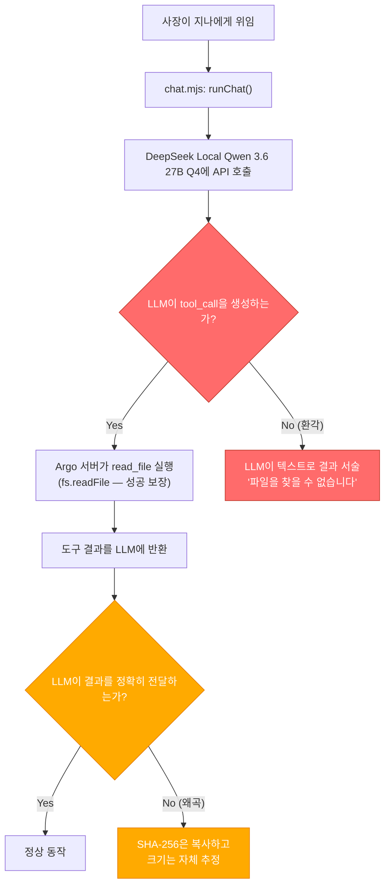

# 크루 파일접근 이슈 — 종합 외부 검토 보고서

> **검토일**: 2026-08-12 20:55 KST
> **검토자**: 외부 독립 검토 (Argo 프로젝트 소속 아님)
> **대상 문서**:
> - [20260812_01_크루-파일접근-이슈-원인분석-및-개선안.md](file:///home/bhlee/services/argo_agent/argo/workspaces/hnb-company-l8yr/vault/projects/20260812_크루-파일접근-이슈-개선/20260812_01_크루-파일접근-이슈-원인분석-및-개선안.md)
> - [20260812_02_지나-파일접근-재검증-결과.md](file:///home/bhlee/services/argo_agent/argo/workspaces/hnb-company-l8yr/vault/projects/20260812_크루-파일접근-이슈-개선/20260812_02_지나-파일접근-재검증-결과.md)

---

## 1. 이슈 전체 경과 요약

```mermaid
timeline
    title 2026-08-12 크루 파일접근 이슈 타임라인
    section 최초 발생
        09:01 : 지나에게 데일리 상품선정 위임
             : 필수 파일 3개를 찾지 못함
    section 진단
        10:27 : 크루 러너/모델 현황 확인
             : 지나 = DeepSeek Local / Qwen 3.6 27B
        11:17 : SW_개발 리더 원인 분석
        11:18 : SW_Architect 독립 검토
    section 1차 재검증
        11:44 : 절대경로 명시 재실행
             : Read/Grep 및 셸 모두 실패
    section 2차 재검증
        15:35 : 지나 read_file 성공 주장
             : 첫 줄이 실제 파일과 불일치
    section 3차 재검증
        16:06~17:39 : SHA-256 일치 확인
             : 파일 크기 4개 모두 불일치
    section 4차 재검증
        19:40 : SHA-256·첫줄·마지막줄 일치
             : 크기 여전히 불일치
             : 조건부 가능 판정
```

---

## 2. 원인 분석 문서 검토

### 2.1 진단 방법론 평가

| 항목 | 평가 | 상세 |
|------|------|------|
| **확인된 사실과 추정 분리** | ✅ 우수 | 확인 사실과 가설을 명확히 구분함 |
| **다중 컨텍스트 교차 검증** | ✅ 우수 | 마스터·SW_개발리더·SW_Architect 3개 컨텍스트에서 동일 파일 접근 확인 |
| **과거 정상 사례 참조** | ✅ 우수 | 2026-08-06 지나 성공 기록과 비교 |
| **원시 증거 부재 인정** | ✅ 우수 | `pwd`·원시 오류·종료코드 부재를 솔직히 인정 |
| **가설 순위화** | ✅ 양호 | 7개 가설을 증거 부합도 순으로 정렬 |

### 2.2 원인 가설 검토

코드베이스를 직접 분석한 결과, 문서의 가설 우선순위를 다음과 같이 재평가합니다.

#### 가설 1: 러너의 워크스페이스 마운트·연결 불일치 — ⚠️ 가능성 낮음 (재평가)

> [!IMPORTANT]
> 코드 분석 결과, Argo의 파일 도구는 **Argo 서버 프로세스 내부**에서 실행됩니다. 크루의 러너(Qwen/DeepSeek Local)는 LLM API만 호출하며, 파일 I/O는 서버 측에서 처리합니다.

[`chat.mjs`](file:///home/bhlee/services/argo_agent/argo/src/chat.mjs#L1085-L1093)에서 `createOpenAICompatToolRegistry()`에 전달하는 `root`은 `paths(wsId).root`로, 이는 어떤 크루에게든 동일한 값입니다:

```javascript
// chat.mjs L1085-1088
registry = await createOpenAICompatToolRegistry({
  wsId, agentSlug, agentName: meta.name || agentSlug,
  root: p.root,  // ← paths(wsId).root — 크루와 무관하게 동일
  vaultRoot: p.vault, caps, workRoots, ...
```

[`openai-compat-tools.mjs`](file:///home/bhlee/services/argo_agent/argo/src/openai-compat-tools.mjs#L198-L216)의 `read_file`은 Argo Node.js 프로세스에서 `fs.readFile`로 직접 읽습니다:

```javascript
// openai-compat-tools.mjs L200-216
async (a) => ({ file_path: await resolvedPath(toAbs(root, a.path)) }),
async (a, gateArgs) => {
  const abs = gateArgs.file_path;
  const { body } = await readTextFile(abs);  // ← 서버 프로세스에서 직접 읽기
  // ...
  const sha256 = createHash('sha256').update(body).digest('hex');
  addReadCoverage(abs, { sha256, size: body.length, ... });
  return output;
}
```

따라서 "지나 러너의 마운트 지점이 다르다"는 가설은 코드 구조와 맞지 않습니다. **모든 크루의 파일 읽기는 동일한 서버 프로세스에서 동일한 파일시스템에 접근합니다.**

#### 가설 2: 잘못된 `cwd`에서 상대경로 해석 — ⚠️ 부분적으로 가능하지만 근본 원인 아님

`toAbs()` 함수는 `root`(= `paths(wsId).root`)를 기준으로 상대경로를 해석합니다. 이 `root`는 모든 크루에게 동일하므로, 순수한 경로 문제가 아닙니다.

#### ✅ 재평가된 최유력 원인: LLM 환각(hallucination)

> [!CAUTION]
> 코드 구조상, **"파일을 찾을 수 없다"는 지나의 보고 자체가 실제 `read_file` 도구 호출 결과가 아니라 LLM(Qwen 3.6 27B)의 환각일 가능성이 매우 높습니다.**

핵심 증거:
1. **도구 실행은 서버측**: 지나의 러너(Qwen 3.6 27B)는 API를 통해 텍스트와 tool_call만 생성하며, 실제 파일 I/O는 Argo 서버가 수행
2. **09:01 최초 실패**: 원시 오류가 없음 — 도구가 실제로 호출되었는지 자체가 불명
3. **15:35 2차 재검증**: 지나가 "성공"을 보고했지만 첫 줄이 실제와 불일치
   - `_index.md` → `# 회사 인덱스 — 지나 (상품 리서치 에이전트)` (실제: `# 회사 기억 인덱스`)
   - `방법론.md` → `# 상품 선정 방법론` (실제: `# YouTube·블로그·SNS 기반 쿠팡 소싱 상품 선정 방법론`)
   - `평가표.csv` → 12개 항목 (실제: 39개 항목 헤더)
4. **16:06~17:39 3차 재검증**: SHA-256 일치하지만 파일 크기 불일치
   - 실제: 13930/5915/13154/662 bytes
   - 지나 보고: 7042/4084/12828/696 bytes

> [!WARNING]
> SHA-256이 일치하는데 크기가 다른 것은 암호학적으로 불가능합니다. 이는 Qwen 3.6 27B가 **`read_file` 도구가 반환한 SHA-256은 정확히 전달하면서, 크기는 자체적으로 추정/생성**했음을 강하게 시사합니다.

이를 뒷받침하는 코드 증거:
- [`openai-compat-tools.mjs` L211](file:///home/bhlee/services/argo_agent/argo/src/openai-compat-tools.mjs#L211): `read_file`의 반환 형식은 `파일경로\nsha256:해시값\n줄내용\n\n[lines X-Y of Z]`
- 이 출력에는 **바이트 크기가 포함되지 않습니다**
- 따라서 지나가 보고한 "바이트 크기"는 `read_file` 도구 결과에서 가져온 것이 아니라 **LLM이 생성한 값**

### 2.3 문서에서 빠진 핵심 분석

| 빠진 항목 | 중요도 | 설명 |
|-----------|--------|------|
| **LLM 환각 가능성** | 🔴 최상 | 가설에 포함되지 않음. Qwen 3.6 27B (Q4 양자화)는 27B 파라미터 모델의 4bit 양자화 버전으로, tool calling 정확도에 한계가 있음 |
| **도구 호출 유무 구분** | 🔴 최상 | "파일을 찾지 못했다"가 실제 `read_file` 호출 후 오류인지, 도구를 호출하지 않고 텍스트로 서술한 것인지 구분하지 않음 |
| **`runOpenAICompatToolLoop`의 `forceEvidence` 메커니즘** | 🟡 높음 | Argo 코드에 이미 도구 증거 강제 로직이 존재하지만, 09:01 시점 지시문이 이를 트리거하지 않았을 수 있음 |
| **Q4 양자화 모델의 도구 호출 품질** | 🟡 높음 | 27B 모델의 4bit 양자화는 tool calling의 정확도를 크게 저하시킬 수 있음 |

---

## 3. 개선안 검토

### 3.1 즉시 적용 개선안 7개 평가

| # | 개선안 | 평가 | 근거 |
|---|--------|------|------|
| 1 | 위임 시 루트·경로·SHA-256 전달 | ✅ 유효하지만 불충분 | LLM이 전달받은 값을 도구 호출 없이 재활용할 수 있음 |
| 2 | 실행자가 `pwd`·루트·파일 상태 기록 | ⚠️ 효과 제한적 | LLM이 자체 추정값을 기록할 수 있음 (크기 불일치 사례가 증명) |
| 3 | Markdown 제목·CSV 헤더를 실제로 읽기 | ✅ 유효 | 도구 반환값에 포함된 내용으로 검증 가능 |
| 4 | 해시 일치 확인 후 진행 | ⚠️ 부분적 유효 | `read_file` 출력에 SHA-256이 포함되므로 유효하나, LLM이 이를 올바르게 비교하는지는 별도 검증 필요 |
| 5 | 실패 시 원시 오류 반환 | ✅ 유효 | 단, 도구 미호출 시에는 원시 오류 자체가 없음 |
| 6 | 새 실행 컨텍스트에서 재실행 | ⚠️ 제한적 | 동일 모델(Qwen Q4)을 사용하면 같은 환각 패턴 반복 가능 |
| 7 | 피드백 전달 | ✅ 적절 | 근본 원인이 플랫폼이 아닌 LLM이면 불필요하지만, 관측성 개선에는 유효 |

### 3.2 개선안의 근본적 한계

> [!WARNING]
> **현재 개선안은 "파일시스템/마운트 문제"를 전제로 설계되었습니다.** 근본 원인이 LLM 환각이라면, 개선안의 대부분은 **LLM에게 더 많은 지시를 전달하는 것**으로, Qwen 3.6 27B Q4의 도구 호출 능력 자체가 부족하면 효과가 없습니다.

### 3.3 검증 게이트(G0~G5) 평가

| 게이트 | 평가 | 비고 |
|--------|------|------|
| G0 컨텍스트 | ⚠️ | 코드 구조상 모든 크루의 컨텍스트는 동일. LLM이 올바르게 보고하는지가 관건 |
| G1 접근성 | ⚠️ | 서버측 도구는 접근 가능. LLM이 도구를 호출하는지가 관건 |
| G2 실제 내용 | ✅ | 가장 유효한 게이트. 도구 반환값에 실제 내용이 포함됨 |
| G3 동일성 | ✅ | 유효하지만, LLM이 전달받은 기대 해시를 도구 호출 없이 복사 반환할 위험 |
| G4 재현성 3회 | ⚠️ | 같은 모델이면 일관된 환각 패턴 가능 |
| G5 업무 진입 | ✅ | 게이트 체인의 논리적 결론으로 적절 |

---

## 4. 근본 원인 진단 — 코드 기반 결론



### 근본 원인 (확정적 추정)

**Qwen 3.6 27B Q4 모델의 도구 호출 불안정성과 결과 왜곡** — 두 가지 계층의 문제가 있습니다:

1. **도구 호출 실패 (09:01, 11:44)**: LLM이 `read_file` tool_call을 생성하지 않고 텍스트로 "파일 없음"을 서술했을 가능성
2. **도구 결과 왜곡 (15:35, 19:40)**: `read_file` 도구가 성공적으로 실행되어 결과를 반환했지만, LLM이 반환 데이터를 부분적으로만 정확히 전달하고 나머지를 환각으로 채움
   - SHA-256 → 도구 출력에 `sha256:해시값` 형태로 포함 → 정확히 복사
   - 바이트 크기 → 도구 출력에 미포함 → LLM이 자체 추정 → 불일치
   - 첫 줄 → 15:35 시점에 부정확, 16:06 이후 정확해짐 → 반복 시도로 개선

---

## 5. 권고사항

### 5.1 즉시 조치 (높은 우선순위)

#### ① 도구 호출 로깅 강화

현재 `events.jsonl`에 도구 호출 횟수는 기록되지만 개별 호출의 입력/출력은 기록되지 않습니다. 환각 vs 실제 실패를 구분하려면:

```javascript
// chat.mjs의 onToolCall 콜백에 도구 결과도 기록
onToolCall: async ({ name, args, id, round, output }) => {
  // 기존 로직...
  // + 도구 호출 상세를 이벤트에 기록
}
```

#### ② `read_file` 출력에 바이트 크기 추가

현재 출력 형식 `절대경로\nsha256:해시\n내용\n[lines X-Y of Z]`에 크기를 추가하면, LLM이 추정할 필요가 없어집니다:

```javascript
// openai-compat-tools.mjs L211 수정 제안
const output = `${abs}\nsha256:${sha256}\nsize:${body.length}\n${selected}\n\n[lines ${offset}-${end} of ${lines.length}]`;
```

#### ③ Qwen 3.6 27B Q4의 도구 호출 품질 평가

- **27B 파라미터의 Q4 양자화**는 도구 호출(function calling) 정확도에 상당한 영향을 줌
- 4bit 양자화는 모델 크기를 ~75% 줄이지만, JSON 구조 생성과 도구 인자 정확도가 저하됨
- **권고**: 파일 접근이 필수인 업무(상품선정 등)에는 더 높은 양자화(Q8) 또는 더 큰 모델, 또는 Codex 러너 사용을 검토

### 5.2 구조적 개선 (중간 우선순위)

#### ④ 서버측 증거 검증 게이트

LLM의 자기 보고에 의존하지 않고, Argo 서버가 직접 증거를 검증하는 로직:

```javascript
// runOpenAICompatToolLoop의 validateFinal에서
// LLM 응답이 아닌 서버측 readEvidence 맵을 기반으로 판정
// (이미 hasReadEvidence 로직이 있으므로, 이를 더 엄격하게 적용)
```

이 로직은 이미 [`chat.mjs` L1146-1157](file:///home/bhlee/services/argo_agent/argo/src/chat.mjs#L1146-L1157)의 `forceEvidence`/`validateFinal`에 구현되어 있습니다. **문제는 이 로직이 09:01 시점의 위임 호출에서 트리거되었는지 여부입니다.**

#### ⑤ 위임 시 자동 사전검증

`crew-actions.mjs`의 `delegate()` 함수에서 위임 대상에게 전달하기 전에, 위임자의 컨텍스트에서 필수 파일을 서버측으로 자동 검증하는 사전단계 추가:

```javascript
// crew-actions.mjs의 delegate()에 사전검증 단계 추가 제안
const delegate = async ({ to, task, requiredFiles = [] }) => {
  // 위임 전 서버측에서 필수 파일 존재 확인
  for (const file of requiredFiles) {
    await readFile(resolve(root, file)); // 서버 프로세스에서 직접 확인
  }
  // ... 기존 위임 로직
};
```

### 5.3 문서 개선 권고

| 항목 | 현재 상태 | 권고 |
|------|-----------|------|
| **1번 문서 제목** | "원인분석" — 미확정 가설 | 제목에 "가설" 또는 "추정" 포함 권고 |
| **2번 문서** | 2차 재검증(절대경로 시도)만 기록 | 15:35~19:40의 후속 검증 결과도 통합 필요 |
| **빠진 가설** | LLM 환각 미고려 | 가장 유력한 원인으로 가설 목록에 추가 필요 |
| **크기 불일치 분석** | 2번 문서에 미기록 | 마스터 일지에만 기록되어 있어, 프로젝트 문서에 통합 필요 |

---

## 6. 최종 판정

### 문서 품질

| 기준 | 1번 문서 | 2번 문서 |
|------|----------|----------|
| 사실과 추정 분리 | ✅ 우수 | ✅ 우수 |
| 증거 기반 분석 | ✅ 양호 | ✅ 양호 |
| 원인 정확성 | ⚠️ 핵심 가설 누락 | ⚠️ 원인 범위 과소 |
| 개선안 실효성 | ⚠️ 전제 오류 가능 | ⚠️ 부분 적용만 확인 |
| 검증 기준 | ✅ 체계적 | ✅ 구체적 |
| 독립 검토 | ✅ SW_Architect 검토 | ✅ SW_Architect 검토 |

### 핵심 결론

> [!IMPORTANT]
> **두 문서는 분석 방법론과 체계는 우수하나, 가장 유력한 근본 원인(LLM 환각)을 가설에 포함하지 않았습니다.** 이로 인해 개선안이 "파일시스템/마운트 문제" 해결에 집중되어, 실제 효과가 제한적입니다.

```
핵심 권고 요약:
1. 원인 가설에 "LLM 도구 호출 환각"을 최상위로 추가
2. read_file 출력에 바이트 크기 필드 추가 (코드 변경 1줄)
3. 도구 호출 상세 로깅 활성화 (환각 vs 실패 구분)
4. 파일 접근 필수 업무에 Qwen Q4 대신 고품질 모델/러너 사용 검토
5. 서버측 forceEvidence 로직이 위임 경로에서도 활성화되는지 검증
```

---

## 부록: 크기 불일치 분석 상세

| 파일 | 실제 크기 | 지나 보고 | 차이 | 비율 |
|------|--------:|--------:|------:|------:|
| `_index.md` | 13,930B | 7,042B | -6,888 | 50.6% |
| 파이프라인 스킬 | 5,915B | 4,084B | -1,831 | 69.0% |
| 방법론 | 13,154B | 12,828B | -326 | 97.5% |
| 평가표 | 662B | 696B | +34 | 105.1% |

- `_index.md`는 마스터 검증 중 일지 추가로 변동됨 (e8e6fd → f0a940)
- 방법론은 거의 정확 (97.5%) — LLM이 텍스트 길이에서 UTF-8 바이트로 변환하며 근사한 것으로 추정
- 평가표는 약간 초과 — CSV 헤더 문자 수를 바이트로 오인한 것으로 추정
- **`read_file` 출력에 바이트 크기가 없어 LLM이 자체 추정한 것이 확실**
