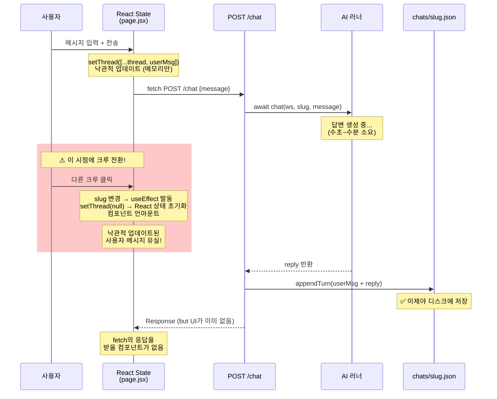

# 크루 전환 시 질문 사라짐 이슈 — 원인 분석

> **분석일**: 2026-08-12 21:50 KST

---

## 결론 (TL;DR)

**사용자 메시지는 답변 생성이 완료된 후에만 디스크에 저장됩니다.**
답변 생성 중 크루를 전환하면 React 컴포넌트가 언마운트되면서 메모리상의 낙관적 업데이트(메시지)가 유실되고, 서버에도 아직 저장되지 않았으므로 메시지가 완전히 사라집니다.

---

## 문제의 전체 흐름



---

## 원인 분석 (코드 근거)

### 원인 1: `appendTurn`이 답변 완료 후에만 실행

[`app/api/companies/[ws]/chat/route.js`](file:///home/bhlee/services/argo_agent/argo/app/api/companies/%5Bws%5D/chat/route.js) L59-62:

```javascript
// 1. 답변 생성 대기 (수초~수분)
const t = await chat(ws, slug, message.trim(), sessionId || null, { attachments });
// 2. 답변 완료 후 비로소 디스크에 저장
const saved = await appendTurn(ws, slug, {
  userMsg: message.trim(), reply: t.reply, ...
});
```

[`src/thread.mjs`](file:///home/bhlee/services/argo_agent/argo/src/thread.mjs) L26-43에서 `appendTurn`은 **사용자 메시지와 크루 답변을 한 쌍으로** 동시에 저장합니다:

```javascript
t.messages.push(
  { who: 'user', text: userMsg, ts },  // 사용자 메시지
  { who: 'crew', text: reply, ts },    // 크루 답변
);
await writeJsonAtomic(file(wsId, slug), t);
```

→ **답변이 없으면 사용자 메시지도 저장되지 않습니다.**

### 원인 2: 크루 전환 시 React 상태 초기화

[`app/c/[ws]/crew/[slug]/page.jsx`](file:///home/bhlee/services/argo_agent/argo/app/c/%5Bws%5D/crew/%5Bslug%5D/page.jsx) L279-298:

```javascript
useEffect(() => {
  let alive = true;
  // ⚠️ slug가 바뀌면 즉시 thread를 null로 초기화
  setThread(null); setError(''); sessionRef.current = null;
  // 새 크루의 대화를 서버에서 로드
  api(`/api/companies/${ws}/chat?slug=${slug}&limit=...`)
    .then((data) => { if (!alive) return; setThread(data.messages); })
    ...
  return () => { alive = false; };
}, [ws, slug]);  // slug 변경에 반응
```

크루 전환 = **slug 변경** → `useEffect` cleanup + 재실행 → `setThread(null)` → **이전 크루의 낙관적 메시지 유실**

### 원인 3: 프론트엔드에서 요청 취소를 하지 않음

`sendMessage`의 `api()` 호출에 `AbortController`가 연결되어 있지 않습니다. 따라서:

- **백엔드 작업은 계속 진행됨** (크루 전환해도 답변 생성은 중단되지 않음)
- **그러나 fetch 응답을 받을 컴포넌트가 이미 없음** (언마운트됨)
- **결과**: 백엔드가 답변을 완료하면 `appendTurn`이 실행되어 디스크에 저장은 됨

---

## 시나리오별 결과

| 시나리오 | 질문 표시 | 디스크 저장 | 돌아왔을 때 |
|----------|----------|------------|------------|
| 같은 크루에 머물러 있음 | ✅ 화면에 보임 | ✅ 답변 후 저장 | — |
| 전환 후 답변 완료 전 돌아옴 | ❌ 사라짐 (서버에서 GET, 아직 미저장) | ❌ 아직 저장 안 됨 | 빈 상태 |
| 전환 후 답변 완료 후 돌아옴 | ✅ 복원됨 (서버 GET으로 로드) | ✅ appendTurn 완료 | 정상 |
| 전환 후 답변 실패(에러) | ❌ 영구 소실 | ❌ appendTurn 미도달 | 빈 상태 |

> [!IMPORTANT]
> **핵심 모순**: 코드 주석에 "도중엔 이 사본이 사장 글의 유일한 원본이다"라고 명시하면서도, 크루 전환 시 이 "유일한 원본"이 유실되는 것을 방어하지 않습니다.

---

## 개선안

### 방안 A: 사용자 메시지 사전 저장 (권장)

`appendTurn`을 분리하여, 사용자 메시지를 **답변 생성 전에** 먼저 디스크에 기록합니다.

```javascript
// app/api/companies/[ws]/chat/route.js — 변경안
export async function POST(req, { params }) {
  const { ws } = await params;
  const { slug, message, sessionId, attachments } = await req.json();
  
  // 1단계: 사용자 메시지를 즉시 디스크에 저장 (pending 상태)
  await appendUserMessage(ws, slug, { userMsg: message.trim(), attachments });
  
  // 2단계: 답변 생성
  const t = await chat(ws, slug, message.trim(), sessionId || null, { attachments });
  
  // 3단계: 크루 답변 추가 (pending 해제)
  const saved = await completeUserMessage(ws, slug, {
    reply: t.reply, handover, sessionId: t.sessionId, artifacts: t.artifacts
  });
  return Response.json({ ... });
}
```

**장점**: 답변 완료 여부와 관계없이 사용자 메시지가 항상 보존됨
**단점**: `thread.mjs`의 구조 변경 필요, 실패 시 pending 메시지 정리 로직 필요

### 방안 B: 프론트엔드 임시 저장 (최소 변경)

크루 전환 시 진행 중인 메시지를 `localStorage`에 임시 보관합니다.

```javascript
// page.jsx — useEffect cleanup에 추가
useEffect(() => {
  return () => {
    // 언마운트 시 진행 중인 낙관적 메시지를 localStorage에 보존
    if (busyRef.current && pendingMidRef.current) {
      const pending = threadRef.current?.find(m => m.mid === pendingMidRef.current);
      if (pending) {
        localStorage.setItem(`argo-pending:${ws}:${slug}`, JSON.stringify(pending));
      }
    }
  };
}, [ws, slug]);
```

**장점**: 변경 최소 (프론트엔드만)
**단점**: 백엔드 실패 시 orphan 메시지 처리 필요, localStorage 의존

### 방안 C: 백엔드 선저장 + 낙관적 조회

API 라우트에서 `chat()` 호출 전에 사용자 메시지만 먼저 `appendUserMsg`로 저장하고, GET 조회 시 pending 포함 반환합니다.

```javascript
// thread.mjs에 추가
export async function appendUserMsg(wsId, slug, { userMsg, attachments }) {
  return withLock(lockKey(wsId, slug), async () => {
    const t = await loadThread(wsId, slug);
    t.messages.push({ who: 'user', text: userMsg, ts: Date.now(),
      pending: true, ...(attachments?.length ? { attachments } : {}) });
    await writeJsonAtomic(file(wsId, slug), t);
    return t;
  });
}
```

**장점**: 어떤 경우에도 사용자 메시지 보존, 서버 중심 단일 진실 소스
**단점**: 실패/중단 시 pending 메시지 정리 로직 필요

---

## 관련 파일

| 파일 | 역할 |
|------|------|
| [`chat/route.js`](file:///home/bhlee/services/argo_agent/argo/app/api/companies/%5Bws%5D/chat/route.js) | POST 핸들러 — `chat()` → `appendTurn()` 순서 |
| [`thread.mjs`](file:///home/bhlee/services/argo_agent/argo/src/thread.mjs) | `appendTurn` — user+crew 메시지 쌍으로 저장 |
| [`page.jsx`](file:///home/bhlee/services/argo_agent/argo/app/c/%5Bws%5D/crew/%5Bslug%5D/page.jsx) | `sendMessage` 낙관적 업데이트, slug 변경 시 `setThread(null)` |
| [`chat.mjs`](file:///home/bhlee/services/argo_agent/argo/src/chat.mjs) | 러너 실행 후 `saveHandover` (일지 저장) |
