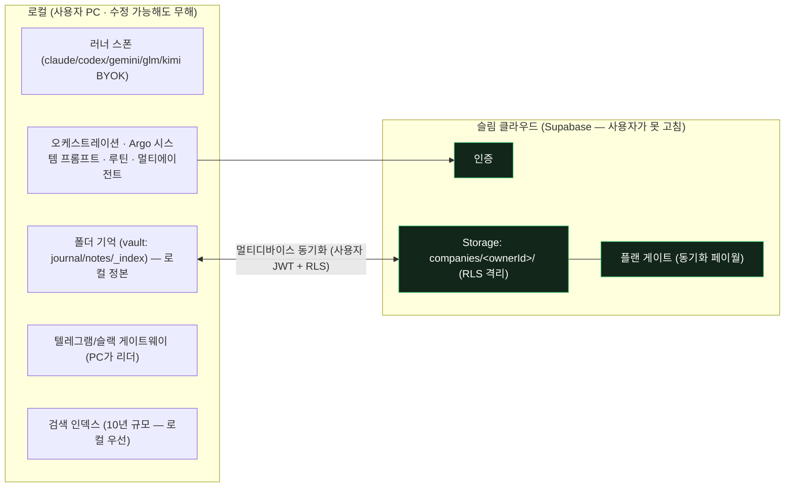

# Argo 설계 방향 — 로컬 우선 + 슬림 클라우드

> 2026-07-23 유건 스코프 확정. 이 문서가 **현 스코프의 정본**이다.
> 어제 [`cloud-hybrid-design.md`](cloud-hybrid-design.md)는 *24h 클라우드 워커 + 클라우드 실행*을 전제한 대공사였는데,
> 24h 상주를 뒤로 미루는 순간 그 전제가 사라진다 — 이 스코프에선 **과설계**다. 그 문서는 참고용으로 강등(§8).
> 코드 변경 없음(설계만). 시크릿 평문 금지(env는 이름만).

## 1. North Star (유건 확정 비전)

> 로컬에서 자가 학습·성장하는 AI 회사. **폴더째 방대한 기억**을 10년이 지나도 유지하고 정확·빠르게 찾아내며,
> 로컬 작업을 텔레그램/슬랙으로 바로 이어가고(PC 켜짐 전제), 어떤 러너를 붙여도 **Argo만의 시스템 프롬프트**로 돈다.

원하는 능력(사용자 정의):
1. 자가 학습·성장(Hermes형 — 경험에서 스킬을 만들고 사용 중 개선)
2. **폴더째 기억**(마크다운 한 장이 아니라 폴더 전체가 기억) — Argo의 특장점
3. 10년 후에도 전 맥락 유지 + 정확·빠른 검색
4. 로컬 ↔ 텔레그램/슬랙 맥락 이어가기 (PC 켜짐 전제, 24h 상주 아님)
5. 러너 무관 Argo 시스템 프롬프트
6. 루틴(예약)·자동화 업무를 프롬프트 한 줄로 생성
7. 멀티 에이전트 to/cc/hop/inbox/outbox 소통
8. 멀티 에이전트 loop
9. 현재 기능 유지

**수익화 앵커 = 멀티 디바이스 로그인 시 맥락 유지** (24h 상주는 후순위). — PRODUCT-SPEC의 원래 유료 앵커와 일치.

## 2. 핵심 결정 — 로컬 우선, 클라우드는 "기억이 따라오게"만

- **러너·기억·오케스트레이션 = 전부 로컬.** 내 기기·내 데이터라 **수정 가능해도 무해**하다(Hermes·Claude Code의 로컬 클라이언트 모델). `permission-gate.mjs`는 로컬 안전·UX 어포던스로 남되, 보안 경계 역할은 지지 않는다.
- **클라우드 = 슬림 Supabase**(인증 + Storage + RLS)로 **멀티 디바이스 기억 동기화만**. 24h 클라우드 워커·클라우드 러너 컨테이너·클라우드 실행 테넌트 격리 = **제외**(불안정·비용·위험의 근원을 통째로 뺀다).

이 결정 하나로 어제 문서의 "제품 로직을 클라우드로 옮기는" 대공사가 불필요해진다 — 옮길 이유(로컬 프로세스가 과금·테넌트를 집행)가 24h/클라우드 실행과 함께 사라지기 때문.

## 3. 경계 — 무엇이 로컬, 무엇이 서버

## 4. 반드시 서버측이어야 할 것 — 딱 2개 (보안 숙제)

로컬을 아무리 뜯어고쳐도 뚫리면 안 되는 건 이 둘뿐이다. 둘 다 작고 경계가 명확하다.

1. **저장소 격리** — 이미 서버측 RLS(`companies/<ownerId>/`, 사용자 JWT; `20260714090000_companies_storage_rls.sql`). 남은 일 = **서비스롤 키가 클라이언트에 남지 않도록 완주**. 호스티드 동기화 경로는 사용자 JWT+RLS만 쓰고(기기 세션, `devicesession.mjs`), 서비스롤은 **셀프호스트(자기 Supabase, 본인이 곧 오너)에서만**.
2. **동기화 페이월** — 무료 계정의 *클라우드* 동기화를 **서버가 거부**해야 한다(RLS 정책이 `entitlements` 참조, 또는 인증 엔드포인트가 plan 확인). 현재 `entitlement.mjs`의 소프트 게이트(`ARGO_ENFORCE_PLAN`, 클라이언트 사이드)를 **서버측으로 이전**. 무료 사용자는 로컬 전부 무제한, 클라우드 동기화만 막힌다.

→ 이 둘만 서버에 있으면: 로컬을 고쳐도 **남의 기억 못 보고, 공짜로 클라우드 동기화 못 한다.** 나머지는 전부 로컬이라 수정돼도 자기 것만 건드린다.

## 5. 기능 맵 (코드 근거 기반)

| # | 원하는 기능 | 상태 | 근거 / 남은 일 |
|---|---|---|---|
| 2 | 폴더째 기억(특장점) | **코어 있음** | `memory.mjs`·`consolidate.mjs`·vault 스캐폴드(`provision.mjs`) |
| 4 | 텔레그램/슬랙 핸드오프 | **있음** | `gateway.mjs`(PC가 리더), 24h 워커 빠져 오히려 단순 |
| 5 | 러너 무관 시스템 프롬프트 | **있음** | `chat.mjs`(주입 + `settingSources:[]`), 5러너 BYOK(`runners.mjs`) |
| 6 | 루틴 한 줄 생성 | **엔진 있음** | `routines.mjs`·`scheduler.mjs` — "한 줄 → 루틴" 생성 UX만 보강 |
| 7 | to / cc / inbox | **있음** | `gateway.mjs`(@a @b → to+cc), `thread.mjs`(cc 공유), `provision.mjs`(inbox 서류함), 위임(`usage.mjs` delegate) |
| 7 | **outbox / hop(멀티홉 릴레이)** | **신규** | 크루→크루 발신함 + 다중 홉 전달 프로토콜 설계 필요 |
| 8 | 멀티에이전트 경쟁·회의 | **있음** | `compete.mjs`(모델별 경쟁), `room.mjs`(회의실) |
| 8 | **범용 멀티에이전트 loop** | **신규** | 경쟁/위임/회의를 building block으로, 반복·수렴 루프 설계 |
| 1 | **스킬 자가개선(경험→스킬)** | **신규** | 지금은 기억 통합(`consolidate.mjs`) + 정적 스킬 카탈로그(`market.mjs`)뿐. "경험에서 스킬 생성·사용 중 개선" 루프는 추가 |
| 9 | 현재 기능 유지 | — | 로컬 무인증·셀프호스트 모드 이미 존재(`app/auth.mjs` AUTH_ON, `docs/selfhost.md`) |

절반 이상이 **이미 있고**, 신규 3종(outbox·hop / loop / 스킬 자가개선)은 전부 **파일·JSON 위 로컬 로직**이라 인프라 위험이 아니라 개발 분량이다.

## 6. 유일한 진짜 난제 — 10년 규모 검색

안정성 문제가 아니라 **품질·스케일** 문제. 지금은 TF-IDF 스파이크 + grep/read(`memory.mjs`)라 10년 규모엔 부족 — **임베딩 인덱스**가 필요하다.

- **옵션 A(권고): 로컬 인덱스** — sqlite-vec 등 로컬 벡터 검색. 기억이 로컬 정본이라 자기완결·프라이버시 우수, 오프라인 동작.
- **옵션 B: 클라우드 인덱스** — pgvector(PRODUCT-SPEC 예고). 동기화 계정에 한해 옵션으로. 서버 부담·프라이버시 트레이드오프.
- 권고: **로컬 인덱스를 기본**으로, 대규모 동기화 사용자에 한해 클라우드 인덱스를 선택지로. 이게 이 제품의 핵심 가치라 **어차피 풀어야 할** 최우선 R&D.

## 7. 이행 = 진화 (포크 아님, 릴리즈 라인 유지)

별도 신규 생성이 아니라 **현재 Argo의 진화**다. 매 단계 로컬 무인증·셀프호스트·현재 기능 무중단.

- **Phase 1 — 슬림화·하드닝**: 24h 워커 경로 비활성/격리 · **페이월 서버측 이전**(§4-2) · **서비스롤 클라이언트 제거 완주**(§4-1) · M-ENC-1(기억 봉투 암호화 — 클라우드 동기화 GA 전 필수, `security-encryption-roadmap.md`).
- **Phase 2 — 신규 능력**: 스킬 자가개선 루프 · outbox/hop 멀티홉 메일박스 · 범용 멀티에이전트 loop.
- **Phase 3 — 10년 검색 인덱스**: 로컬 임베딩 인덱스(§6). autolink의 pgvector 전환(`memory.mjs`)과 묶어 설계.

## 8. 이전 문서와의 관계

[`cloud-hybrid-design.md`](cloud-hybrid-design.md)는 **24h 상주·클라우드 실행을 원할 때의** 설계로 유효하다(그 분석 자체는 정확). 다만 현 스코프에선 그 대공사 대신 §4의 **작은 조정 2개 + §7의 진화**만 필요하다. 24h 상주를 다시 최우선으로 올리면 그 문서로 복귀한다.

## 9. 열린 질문

1. 10년 검색 인덱스: 로컬(sqlite-vec) 단일 vs 로컬+클라우드(pgvector) 이중.
2. 페이월 서버측 강제 방식: RLS 정책이 `entitlements` 직접 참조 vs 인증 프록시 엔드포인트가 plan 확인 후 서명 URL 발급.
3. outbox/hop 프로토콜: 파일 기반 발신함(현 inbox 대칭) vs 이벤트 큐. 홉 상한·순환 방지 정책.
4. 스킬 자가개선 안전장치: 자동 생성 스킬의 검수 게이트(자기 승인 금지 — 별 컨텍스트 검수).
