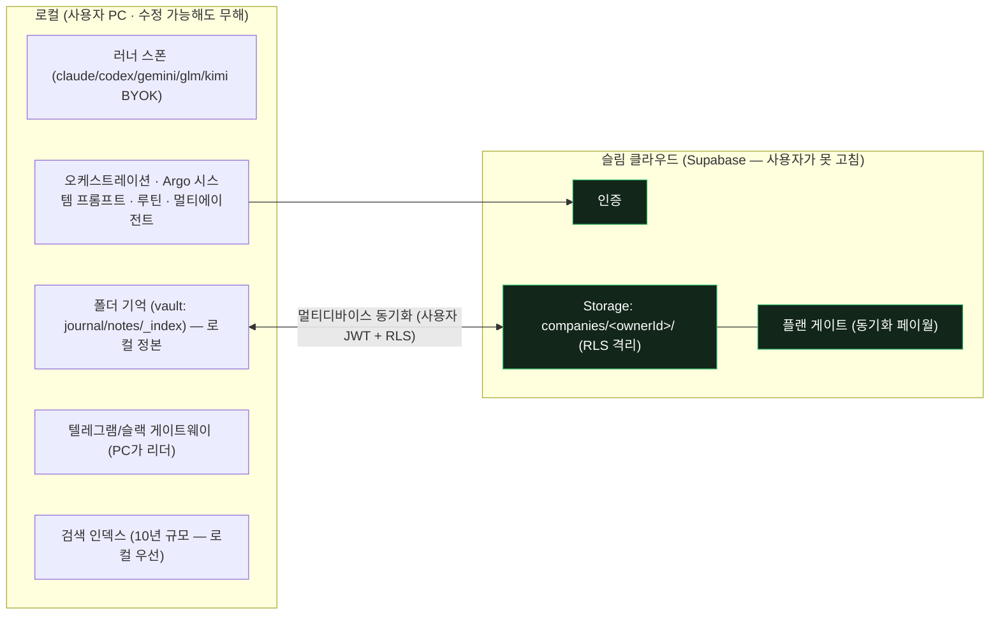

# Argo 설계 방향 — 로컬 우선 + 슬림 클라우드

> 2026-07-23 유건 스코프 확정. 이 문서가 **현 스코프의 정본**이다.
> 어제 [`cloud-hybrid-design.md`](cloud-hybrid-design.md)는 *24h 클라우드 워커 + 클라우드 실행*을 전제한 대공사였는데,
> 24h 상주를 뒤로 미루는 순간 그 전제가 사라진다 — 이 스코프에선 **과설계**다. 그 문서는 참고용으로 강등(§9).
> 코드 변경 없음(설계만). 시크릿 평문 금지(env는 이름만).

## 1. North Star (유건 확정 비전)

> 로컬에서 자가 학습·성장하는 AI 회사. **폴더째 방대한 기억**을 10년이 지나도 유지하고 정확·빠르게 찾아내며,
> 로컬 작업을 텔레그램/슬랙으로 바로 이어가고(PC 켜짐 전제), 어떤 러너를 붙여도 **Argo만의 시스템 프롬프트**로 돈다.

원하는 능력(사용자 정의):
1. 자가 학습·성장(Hermes형 — 경험에서 스킬을 만들고 사용 중 개선)
2. **폴더째 기억**(마크다운 한 장이 아니라 폴더 전체가 기억) — Argo의 특장점
3. 10년 후에도 전 맥락 유지 + 정확·빠른 검색
4. 로컬 ↔ 텔레그램/슬랙 맥락 이어가기 (PC 켜짐 전제, 24h 상주 아님)
5. 러너 무관 Argo 시스템 프롬프트
6. 루틴(예약)·자동화 업무를 프롬프트 한 줄로 생성
7. 멀티 에이전트 to/cc/hop/inbox/outbox 소통
8. 멀티 에이전트 loop
9. 현재 기능 유지

**수익화 앵커 = 멀티 디바이스 로그인 시 맥락 유지** (24h 상주는 후순위). — PRODUCT-SPEC의 원래 유료 앵커와 일치.

## 2. 핵심 결정 — 로컬 우선, 클라우드는 "기억이 따라오게"만

- **러너·기억·오케스트레이션 = 전부 로컬.** 내 기기·내 데이터라 **수정 가능해도 무해**하다(Hermes·Claude Code의 로컬 클라이언트 모델). `permission-gate.mjs`는 로컬 안전·UX 어포던스로 남되, 보안 경계 역할은 지지 않는다.
- **클라우드 = 슬림 Supabase**(인증 + Storage + RLS)로 **멀티 디바이스 기억 동기화만**. 24h 클라우드 워커·클라우드 러너 컨테이너·클라우드 실행 테넌트 격리 = **제외**(불안정·비용·위험의 근원을 통째로 뺀다).

이 결정 하나로 어제 문서의 "제품 로직을 클라우드로 옮기는" 대공사가 불필요해진다 — 옮길 이유(로컬 프로세스가 과금·테넌트를 집행)가 24h/클라우드 실행과 함께 사라지기 때문.

## 3. 경계 — 무엇이 로컬, 무엇이 서버

## 4. 반드시 서버측이어야 할 것 — 딱 2개 (보안 숙제)

로컬을 아무리 뜯어고쳐도 뚫리면 안 되는 건 이 둘뿐이다. 둘 다 작고 경계가 명확하다.

1. **저장소 격리** — 이미 서버측 RLS(`companies/<ownerId>/`, 사용자 JWT; `20260714090000_companies_storage_rls.sql`). 남은 일 = **서비스롤 키가 클라이언트에 남지 않도록 완주**. 호스티드 동기화 경로는 사용자 JWT+RLS만 쓰고(기기 세션, `devicesession.mjs`), 서비스롤은 **셀프호스트(자기 Supabase, 본인이 곧 오너)에서만**.
2. **동기화 페이월** — 무료 계정의 *클라우드* 동기화를 **서버가 거부**해야 한다(RLS 정책이 `entitlements` 참조, 또는 인증 엔드포인트가 plan 확인). 현재 `entitlement.mjs`의 소프트 게이트(`ARGO_ENFORCE_PLAN`, 클라이언트 사이드)를 **서버측으로 이전**. 무료 사용자는 로컬 전부 무제한, 클라우드 동기화만 막힌다.

→ 이 둘만 서버에 있으면: 로컬을 고쳐도 **남의 기억 못 보고, 공짜로 클라우드 동기화 못 한다.** 나머지는 전부 로컬이라 수정돼도 자기 것만 건드린다.

## 5. 기능 맵 (코드 근거 기반)

| # | 원하는 기능 | 상태 | 근거 / 남은 일 |
|---|---|---|---|
| 2 | 폴더째 기억(특장점) | **코어 있음** | `memory.mjs`·`consolidate.mjs`·vault 스캐폴드(`provision.mjs`) |
| 4 | 텔레그램/슬랙 핸드오프 | **있음** | `gateway.mjs`(PC가 리더), 24h 워커 빠져 오히려 단순 |
| 5 | 러너 무관 시스템 프롬프트 | **있음** | `chat.mjs`(주입 + `settingSources:[]`), 5러너 BYOK(`runners.mjs`) |
| 6 | 루틴 한 줄 생성 | **엔진 있음** | `routines.mjs`·`scheduler.mjs` — "한 줄 → 루틴" 생성 UX만 보강 |
| 7 | to / cc / inbox | **있음** | `gateway.mjs`(@a @b → to+cc), `thread.mjs`(cc 공유), `provision.mjs`(inbox 서류함), 위임(`usage.mjs` delegate) |
| 7 | **hop(멀티홉 위임)** | **이미 있음**(2026-07-23 실측 정정) | `chat.mjs:341` 재귀 위임 + `:671` hop≤2 상한·`chain` 순환 차단 + 턴당 2회 상한(`:326-337`). 단 **SDK 러너 전용**(CLI 러너는 위임 도구 미부착), 2홉부터 그룹 미러 무음(`mirrorCtx` 미전파) |
| 7 | **outbox(크루 발신함)** | **신규** | 코드 히트 0건. `paths()`·`provision` 스캐폴드·`gateway` 워처(inbox 대칭)·`makeCrewServer` 도구가 삽입 지점 |
| 8 | 멀티에이전트 경쟁·회의 | **있음** | `compete.mjs`(모델별 경쟁), `room.mjs`(회의실) |
| 8 | **범용 멀티에이전트 loop** | **신규** | 경쟁/위임/회의를 building block으로, 반복·수렴 루프 설계 |
| 1 | **스킬 자가개선(경험→스킬)** | **부분 존재**(2026-07-23 실측 정정) | 생성 자체는 가능 — 프롬프트가 지시(`chat.mjs:192-195`)하고 워크스페이스 내 쓰기는 결재 없이 허용(`permission-gate.mjs:94-100`). **없는 것 = 루프 전체**: 경험 집계·생성 트리거·검수 게이트·개선 측정. 모델은 `consolidate.mjs`(워터마크 증분→원샷→성공 후 커서 전진)를 복제하면 정합 |
| 9 | 현재 기능 유지 | — | 로컬 무인증·셀프호스트 모드 이미 존재(`app/auth.mjs` AUTH_ON, `docs/selfhost.md`) |

**대부분 이미 있다**(2026-07-23 Step 0 실측으로 상향 정정 — `hop` 멀티홉·`inbox` 워처는 완전 동작). 진짜 신규는 **outbox · 범용 loop · 스킬 자가개선 루프** 3종이고, 전부 **파일·JSON 위 로컬 로직**이라 인프라 위험이 아니라 개발 분량이다.

### 5.1 Phase 2 착수 전 선행 안전조건 (Step 0에서 드러난 것)

자가개선·loop을 켜기 전에 반드시 닫아야 할 구멍 — 안 닫으면 자동 생성물이 전 크루에 즉시 퍼진다.

1. **자동 생성 스킬 검수 게이트 부재(최우선)** — 크루는 결재 없이 `skills/*.md`를 쓸 수 있고(`permission-gate.mjs:94-100`), `loadSkills`는 출처 구분 없이 전부 읽어 **다음 턴 전 크루 시스템 프롬프트에 주입**한다(`chat.mjs:27-40`). 최소 변경 경로 = 기존 승인 파이프라인에 `kind:'skill'` 추가(`approvals`/`approval-actions`), 검수는 **생성한 크루가 아닌 다른 러너**(`runOneShot`)로 — 자기 승인 금지.
2. **스킬 6000자 캡 무경고 절단**(`chat.mjs:34` break) — 자가 생성이 늘면 정렬상 뒤 파일이 조용히 사라진다. 경고·우선순위·요약 중 하나가 선행돼야 한다.
3. **팬아웃 상한** — 위임만으로 이미 최대 7턴/지시(턴당 2회 × hop≤2). loop과 결합하면 곱셈이므로 **라운드 상한 + 예산 게이트**(`compete.mjs:77-83` 선례)가 loop 설계의 필수 요소.

## 6. 러너 연결 견고성 (환경 의존 오류)

로컬 우선은 러너를 **여전히 로컬에서** 돌리므로, "로컬 CLI ↔ 로컬 환경" 접점 오류(PATH 미검출·CLI 미설치·OS/키체인 호스트 로그인·OAuth 콜백)는 **자동으로 해소되지 않는다.** 이걸 환경 무관하게 없애는 유일한 길은 러너를 클라우드 컨테이너로 올리는 것(= [`cloud-hybrid-design.md`](cloud-hybrid-design.md)의 Option B)인데, 이 스코프가 뺀 선택이다 — 트레이드오프(로컬 = 공짜·프라이버시·구독OAuth 안전 ↔ 로컬 환경 변수성을 떠안음).

**부분적으로 줄어드는 것**: SaaS 모드 매트릭스발 오류(원클릭 로그인이 `ARGO_TENANT_OWNER` 모드에서 하드 차단, 서비스키 웹 vs 데스크톱 자격 차이, 워커 vs 로컬 러너 크레덴셜 분기, 헤드리스 OAuth 콜백 붙여넣기 폴백)는 로컬 단일 모드로 collapse하면 사라진다.

**진짜 해법 (별도 트랙, 일부 이미 있음)** — Phase 1/2 편입:
- PATH 하드닝(`mergePath` + 로그인셸 `ensureCliPath`, `runners.mjs`) — 이미 있음. GUI 최소 PATH가 1순위 원인.
- CLI 자동 프로비저닝(gemini/codex 다운로드) — 이미 있음. "미설치" 실패 제거.
- **SDK 인프로세스 러너(claude/glm/kimi)를 기본 경로로 승격, 스폰 CLI(codex/gemini)는 폴백** — SDK가 바이너리를 자체 관리해 환경 변수성이 훨씬 적다.
- 연결 실패 **원인별 진단 UI**(PATH? 미설치? 인증만료? OS?) + 원클릭 수정 — 제네릭 에러 대신. 신규.

## 7. 유일한 진짜 난제 — 10년 규모 검색

안정성 문제가 아니라 **품질·스케일** 문제. 지금은 TF-IDF 스파이크 + grep/read(`memory.mjs`)라 10년 규모엔 부족 — **임베딩 인덱스**가 필요하다.

- **옵션 A(권고): 로컬 인덱스** — sqlite-vec 등 로컬 벡터 검색. 기억이 로컬 정본이라 자기완결·프라이버시 우수, 오프라인 동작.
- **옵션 B: 클라우드 인덱스** — pgvector(PRODUCT-SPEC 예고). 동기화 계정에 한해 옵션으로. 서버 부담·프라이버시 트레이드오프.
- 권고: **로컬 인덱스를 기본**으로, 대규모 동기화 사용자에 한해 클라우드 인덱스를 선택지로. 이게 이 제품의 핵심 가치라 **어차피 풀어야 할** 최우선 R&D.

## 8. 이행 = 진화 (포크 아님, 릴리즈 라인 유지)

별도 신규 생성이 아니라 **현재 Argo의 진화**다. 매 단계 로컬 무인증·셀프호스트·현재 기능 무중단.

- **Phase 1 — 슬림화·하드닝 — ✅ 완료(2026-07-23)**. 아래 §8.1 참조.
- **Phase 2 — 신규 능력**: 스킬 자가개선 루프 · outbox/hop 멀티홉 메일박스 · 범용 멀티에이전트 loop · **SDK 러너 기본 승격 / CLI 폴백**(§6).
- **Phase 3 — 10년 검색 인덱스**: 로컬 임베딩 인덱스(§7). autolink의 pgvector 전환(`memory.mjs`)과 묶어 설계.

### 8.1 Phase 1 결과 (2026-07-23 완료)

| 워크스트림 | 결과 | 커밋 |
|---|---|---|
| A 러너 하드닝 | CLI 미발견(ENOENT)을 원인+처방으로 안내. 인증 자가치유·게이트 강등 텍스트는 불변 유지. **A1(SDK 우선 폴백)은 보류** — claude가 이미 1순위라 실효는 glm/kimi를 codex/gemini 앞으로 두는 것뿐인데, 명시 선택엔 무영향이라 실사용 오류를 못 고치고 무선호 시 유료 제공자 선호만 바뀜 | `8591a86` |
| C 서비스롤 완주 | 실측 결과 호스티드는 **이미 JWT+RLS**(페어링 코드는 `AUTH_ON`에서 403 차단, 러너 자식 env 스크럽). 오설정 대비 `serviceCredsAllowed()` 심층방어 추가 | `51b2bf5` |
| B 페이월 서버측 | companies 버킷 **쓰기에 `is_pro` RLS 게이트**(마이그 `20260723001629`). select/delete는 소유자 경계 유지(다운그레이드·내보내기 소유권). 클라는 낙관적 pre-flight로 정비(조회 실패 시 유료 오차단 방지) | `ac0b254` |
| E M-ENC-1 | **E1a 인프라**: `isEncRel`/`ARGO_ENC_VAULT`, 읽기는 스위치 무관 관용 개봉, `sealFor`로 병합 분기 3곳의 평문 유출 차단, 매니페스트 봉투 대상화 | `b8e1223` |
| D 워커 격리 | **코드 변경 불필요** — 리스 TTL(120초)이 워커 종료를 자체 처리해 로컬이 ≤2분 내 리더 회수(`sync.mjs:126-162`) | — |

**검증**: 전체 테스트 159/159 통과, 빌드 성공.

**남은 것은 전부 운영·런치 단계(코드 아님)**:
1. **B 활성화** — 예비 프로젝트 검증 후 prod `supabase db push` + `ARGO_ENFORCE_PLAN=1` → 무료 계정 쓰기 거부 실측.
2. **E1b 플립** — E1a를 **전 기기 배포**(읽기 가능 확보)한 뒤 스위치 ON 통합 테스트 → `ARGO_ENC_VAULT=1` → blob이 `argosecret.v2:`로 시작·평문 맥락 0건 실측.
3. **D** — Fly 워커 미배포 유지.

**미검증 경계(정직 표기)**: 실기기 ENOENT 재현 · 실 DB RLS 왕복 · 스위치 ON 실 sync 왕복은 이 개발 환경에서 불가(실기기/실 Supabase/다기기 필요) — 위 운영 절차의 관문으로 이관했다.

### 8.2 분리 검수 결과 (2026-07-23 · code-reviewer + security-engineer)

구현자 자기 승인을 금지하고 별 컨텍스트 2개로 검수했다. **CRITICAL 1·HIGH 1 포함 5건을 수정**했고 나머지는 아래에 정직히 남긴다.

**수정 완료**

| 심각도 | 지적 | 조치 |
|---|---|---|
| CRITICAL | `EXCLUDE` 첫 가드가 암호화 판정을 먼저 해, 스위치 ON 시 **구조적 제외 규칙 전체가 우회** — `.sync-state.json`(다른 기기 base가 로컬 base를 덮어써 삭제 오판)·`.gw-queue-*`(지시 이중 실행)까지 동기화 대상 | 구조적 제외를 먼저 평가하도록 순서 반전 + **플래그 ON 회귀 테스트 2종** 추가(기존 테스트는 off만 봐서 못 잡았다) |
| HIGH | 리스 갱신 업로드 실패를 무시해 리더 강등 → **요금제와 무관한 루틴·메신저가 조용히 정지** | 1차 수정(무조건 보류)은 **architect가 반려** — 아래 §8.3 참조. 최종: 확인된 보유자·TTL 내에서만 유지 |
| MEDIUM-HIGH | `is_pro(uuid)`가 PUBLIC EXECUTE 기본 부여 + security definer라 **임의 uid의 결제상태 조회 오라클** | 파라미터 제거(내부에서 `auth.uid()`) + `revoke all from public` + 구 시그니처 drop |
| MEDIUM | 매니페스트 봉인이 `cryptoOn()` 미확인 → 키 미확보 사이클에 동기화 하드 정지 | 파일 경로와 동일 가드 적용 |
| MEDIUM | `apiError`가 **stdout**의 "command not found"로 오분류 → 진짜 원인(인증) 소실·자가치유 차단 | stderr 한정 매칭 + 회귀 테스트 |

**문서로 남기는 잔여 (코드 미수정)**

1. **B 활성화 원자성** — 마이그레이션과 `ARGO_ENFORCE_PLAN=1`을 함께 켜지 않으면 무료 계정에서 "삭제만 전파·push 거부" 비대칭. 마이그레이션 헤더에 경고 명시했으나 **CI 강제 장치는 없음**.
2. **혼합 함대 평문 회귀(E1b)** — 스위치 on 기기가 봉인한 파일을 off 기기가 열어 수정 후 **평문으로 재업로드**. 매니페스트에 봉인 세대 표식이 없어 조율 불가 → **전 기기 동시 플립**이 유일한 방어. E1b 관문에 반영.
3. **매니페스트 봉인의 이득 제한** — 스토리지 오브젝트 키(`skey`)가 경로를 그대로 노출하고 비ASCII도 base64url이라 가역. "노트 제목 은닉"이라는 **§E-b 근거는 과대평가였다**; 봉인은 mtime/size/hash 매핑만 가린다. 진짜 경로 은닉은 키 해싱이 필요(별건).
4. **판별 로직 이중 정의** — `authOn`(sync vs `app/auth.mjs`), 서비스 모드(`ensureClient` vs 그 외 호출부)가 각자 재계산. 현재 실피해 없음은 코드로 확인됐으나 리팩터링 시 drift 위험 → 단일화 권장.
5. **버전 뱃지 잔여** — `/api/version` 호출자 0(죽은 코드), 웹은 업데이트 신호 상실, `useAppUpdate`가 layout·settings에서 2벌 인스턴스화(타이머 중복), 마운트 자동 check 실패가 사용자 조작 없이 붉은 에러로 노출.

### 8.3 Architect 최종 검증 1차 반려 → 재수정 (2026-07-23)

§8.2 수정분을 architect가 독립 검증한 결과 **REJECTED**. 4건은 해소가 확인됐으나 **내 HIGH 수정이 원래 문제보다 나쁜 실패 모드를 만들었다.**

| 사유 | 내용 | 재수정 |
|---|---|---|
| **블로커** | 리스 `upErr` **무조건 보류**가 이중 리더를 만든다. 근본 원인 = `leaseState.leader`가 (ㄱ)CAS로 획득한 리더십과 (ㄴ)단일 기기용 기본값 `true`를 **한 필드로 표현** — 보류는 (ㄱ)에만 안전한데 (ㄴ)까지 존중해 **리스를 얻은 적 없는 프로세스가 리더로 고착**. 수정 전 "리더 0명(조용한 정지)" → 수정 후 "리더 2명(루틴 이중 실행·이중 과금·텔레그램 409)"로 **비가역 부작용 쪽으로 트레이드를 뒤집음** | `ownedAt`(확인된 획득 시각)으로 두 출처를 분리. `holdsLeaseOnWriteFailure()` 순수 함수 추출 → **확인된 보유자 + TTL 내에서만 유지**, 그 외(기본값 포함) 강등. 회귀 테스트 4종 |
| **높음** | 마이그레이션의 `drop function is_pro(uuid)`가 **정책 재생성보다 먼저** 와서, 구버전이 적용된 DB에선 의존성 오류로 중단 → revoke·정책 교체가 **아예 미적용**(실 Postgres 재현) | drop을 정책 재생성 **이후 맨 끝**으로 이동 |
| 낮음 | "플래그 ON 회귀 테스트 2종" 표기는 실질 **1종**(키 미확보 케이스는 수정 전에도 통과 = 잠금 아님) | 표기 정정 |

**Architect가 실행으로 확인해준 것**: EXCLUDE 수정은 28 rel × 플래그2 × 키2 = **112건 차등 실행에서 플래그 OFF 회귀 0건**, ON+키에서 18건 복구. `is_pro()`는 로컬 Postgres 재현으로 anon 거부·소유자 경계·멱등 통과. `apiError` stderr 한정은 실 스폰 3케이스로 기능 약화 없음. 새 테스트는 구 코드에서 실제 FAIL(불변식 잠금 확인).

**3차(최종) — APPROVED + 런치 게이트 해소**: architect가 승인하며 남긴 런치 게이트를 마저 닫았다. 앞선 페이월 강등이 **로그인한 무료 계정의 루틴·메신저를 멈추는** 부작용을 낳았고(PRODUCT-SPEC "Free = 로컬 전부 무제한·단일 기기"와 충돌), 근본 원인은 **리스 파일이 Pro 게이트가 걸린 버킷에 있어 무료 계정이 조정용 메타데이터조차 쓸 수 없다**는 것이었다. 해소 = ① 리스 키(`_device-lease.json`)를 RLS Pro 게이트 **예외**로(오너 경계는 유지) ② 리스 중재를 요금제 게이트보다 **먼저** 수행 ③ 페이월 강등 라인 **제거**(중재가 이미 끝난 뒤라 정당한 리더를 덮어씀). 결과: 무료 계정도 정확히 한 대만 리더 → 루틴·메신저 정상, **데이터 동기화만 페이월**.

**변이 검증**: 배선 테스트는 `if (!heldByMe)` 강등 라인 제거 시 **2/3 실패**로 잠금 확인. architect가 앞서 지적한 W2·W3는 "leader:true + 낡은 ownedAt" 조합이 코드상 만들어지지 않아 **활성 버그 아님**으로 정정됐다.

**남은 권고(미착수)**: 활성화 원자성에 **코드 게이트**(RLS 거부 감지 시 `status.paywalled`로 승격해 삭제 전파까지 정지) — 주석 경고만으로 부족하다는 지적. 별건으로 남긴다.

## 9. 이전 문서와의 관계

[`cloud-hybrid-design.md`](cloud-hybrid-design.md)는 **24h 상주·클라우드 실행을 원할 때의** 설계로 유효하다(그 분석 자체는 정확). 다만 현 스코프에선 그 대공사 대신 §4의 **작은 조정 2개 + §8의 진화**만 필요하다. 24h 상주를 다시 최우선으로 올리면 그 문서로 복귀한다.

## 10. 열린 질문

1. 10년 검색 인덱스: 로컬(sqlite-vec) 단일 vs 로컬+클라우드(pgvector) 이중.
2. 페이월 서버측 강제 방식: RLS 정책이 `entitlements` 직접 참조 vs 인증 프록시 엔드포인트가 plan 확인 후 서명 URL 발급.
3. outbox/hop 프로토콜: 파일 기반 발신함(현 inbox 대칭) vs 이벤트 큐. 홉 상한·순환 방지 정책.
4. 스킬 자가개선 안전장치: 자동 생성 스킬의 검수 게이트(자기 승인 금지 — 별 컨텍스트 검수).
5. 러너 기본 경로: SDK 러너(claude/glm/kimi) 우선 + CLI(codex/gemini) 폴백으로 승격 시, codex/gemini 전용 사용자 UX·기능 패리티 유지 방법.
